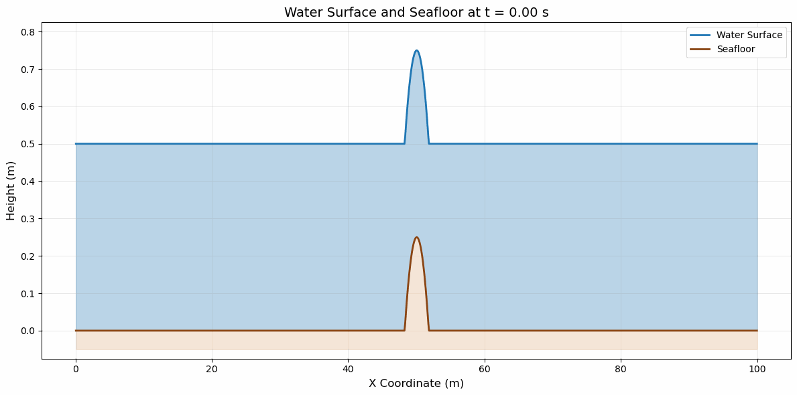
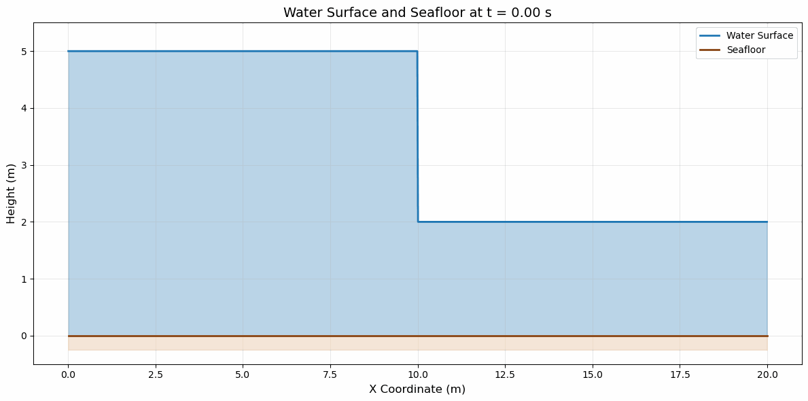
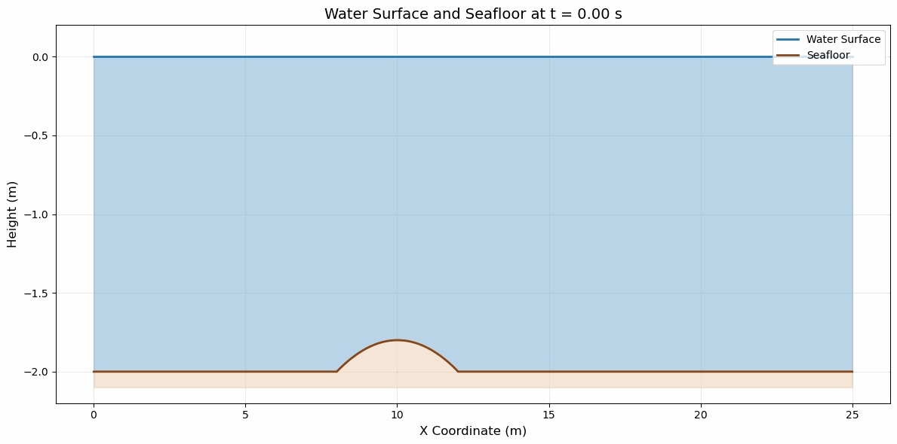
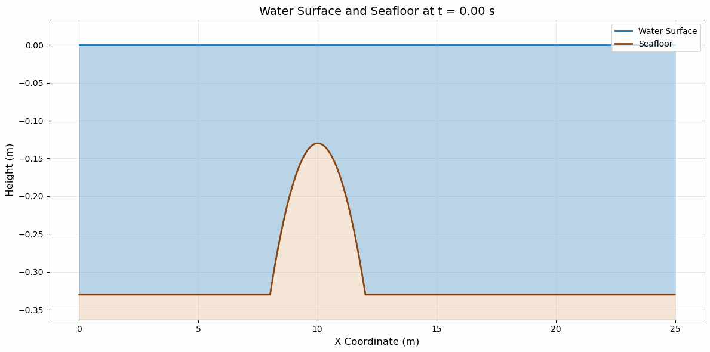
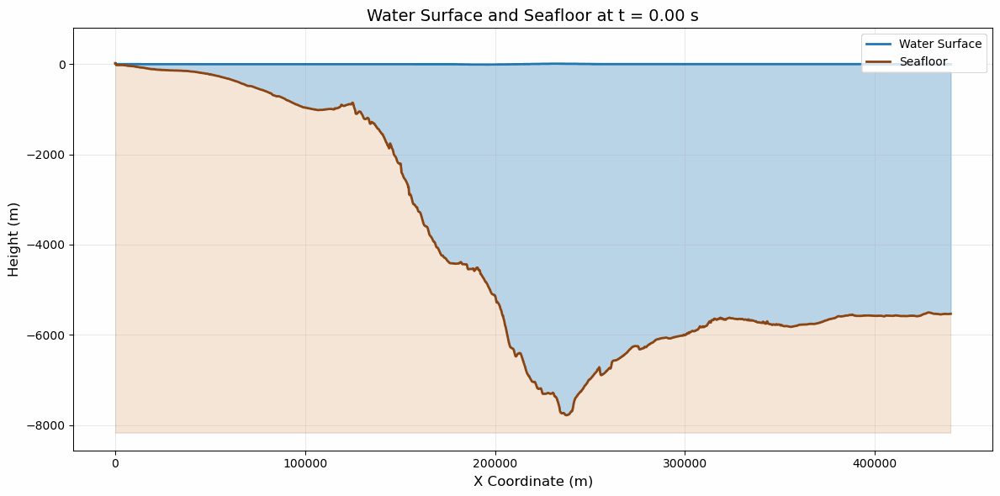

Bathymetry and Boundary Conditions
==================================

**Authors:** Magdalena Schwarzkopf, Dominik Münch

Adding bathymetry
-----------------

Previously, we have assumed that the bathymetry (the underwater topography) is flat and has no effect on the wave propagation.
This is obviously not realistic, so we need a way to include the bathymetry in our model.

To do this we modified the F-Wave Solver to include the bathymetry in the flux calculations.
More specifically, when calculating the jump in flux :math:`\Delta F`, we have to subtract the bathymetry term from the flux jump,
which is given by the following formula:

.. math::

    \begin{split}\Delta x \Psi_{i-1/2} := \begin{bmatrix}
                                0 \\
                                -g (b_r - b_l) \frac{h_l+h_r}{2}
                              \end{bmatrix}.\end{split}

This was implemented in the F-Wave solver like this:

.. code-block:: cpp

    // compute jump in flux
    t_real l_deltaF[2] = {0};
    l_deltaF[0] = i_huR - i_huL;
    l_deltaF[1] = (std::pow(i_huR,2) / i_hR  + 0.5 * std::pow(m_gSqrt,2) * std::pow(i_hR,2))
                    - (std::pow(i_huL,2) / i_hL  + 0.5 * std::pow(m_gSqrt,2) * std::pow(i_hL,2));

    //respect bathymetry
    t_real bathymetryTerm = -std::pow(m_gSqrt, 2)*(i_bR - i_bL) * ((i_hL + i_hR) / 2);
    l_deltaF[1] = l_deltaF[1] - bathymetryTerm;

Since this was previously unaccounted for, a lot of other classes had to be modified to include the bathymetry as well:

``WavePropagation.cpp`` now also has an array for the bathymetry which it passes on to the F-Wave solver when calculating the net updates.
Additionally, when setting the ghostOutflow it also sets this for the bathymetry.

``DamBreak1d.cpp`` now also has an array for the bathymetry and sets it to 0 for the whole domain.

``RareRare1d.cpp`` now also has an array for the bathymetry and sets it to 0 for the whole domain.
There is an additional option to set the bathymetry to a parabola which is controlled through additional parameters passed into the constructor:

.. code-block:: cpp

    tsunami_lab::setups::RareRare1d::RareRare1d( t_real i_height,
                                                t_real i_momentum,
                                                t_real i_locationDiscontinuity,
                                                bool i_useBathymetryParabola,
                                                t_real i_bathymetryOffset,
                                                t_real i_bathymetryCenter,
                                                t_real i_bathymetryScale ) {
        m_height = i_height;
        m_momentum = i_momentum;
        m_locationDiscontinuity = i_locationDiscontinuity;
        m_useBathymetryParabola = i_useBathymetryParabola;
        m_bathymetryOffset = i_bathymetryOffset;
        m_bathymetryCenter = i_bathymetryCenter;
        m_bathymetryScale = i_bathymetryScale;
    }

The parabolic bathymetry is defined mathematically as:

.. math::

    b(x) = \begin{cases}
    b_{\text{offset}} + b_{\text{scale}} \left( x - x_c \right)^2 & \text{if } |x - x_c| \leq w \\
    0 & \text{otherwise}
    \end{cases}

where the half-width :math:`w` is determined by the constraint that the parabola touches zero at its extent:

.. math::

    w = \sqrt{-\frac{b_{\text{offset}}}{b_{\text{scale}}}}

The three controlling parameters are:

- :math:`b_{\text{offset}}`: vertical offset of the parabola (must be non-positive for the parabola to have real roots)
- :math:`b_{\text{scale}}`: quadratic coefficient controlling the curvature (must be positive for a valley-shaped parabola and negative for a hill-shaped parabola)
- :math:`x_c`: x-coordinate of the parabola's center (axis of symmetry)

This implementation ensures that the bathymetry smoothly transitions from the parabolic profile to zero bathymetry outside the parabola's extent.

.. code-block:: cpp

    tsunami_lab::t_real tsunami_lab::setups::RareRare1d::getBathymetry( t_real i_x,
                                                                    t_real ) const {
        if( m_useBathymetryParabola ) {
            if( m_bathymetryScale != 0 ) {
            t_real l_rootSq = -m_bathymetryOffset / m_bathymetryScale;

            if( l_rootSq > 0 ) {
                t_real l_halfWidth = std::sqrt( l_rootSq );

                if( std::abs( i_x - m_bathymetryCenter ) <= l_halfWidth ) {
                return m_bathymetryOffset + m_bathymetryScale * std::pow( i_x - m_bathymetryCenter, 2 );
                }
            }
            }

            return 0;
        }

        return 0;
    }

``ShockShock1d.cpp`` now also has an array for the bathymetry and sets it to 0 for the whole domain.
It also provides the additional option to set the bathymetry to a parabola which works identically to the one in the Rare Rare setup.

To illustrate the effect of the bathymetry, we can look at the following simulation of the Shock Shock setup with a parabolic bathymetry:

- Shock Shock with parameters :math:`(h = 0.5, m = 0.3, l_{\text{discontinuity}} = 50, b_{\text{offset}} = 0.25, b_{\text{center}} = 50.0, b_{\text{scale}} = -0.08)`:

We can clearly see that instead of the wave in the middle having equal height everywhere, there are two peaks on either side.
This would not have happened without the bathymetry.

As is visible in the simulation above, our visualisation has also been updated to show the bathymetry as the seafloor.

All new features have at least one respective unit test.

Adding boundary conditions
--------------------------

Until now, at the edges of the domain we have been using ghost cells that simply copy the values of the adjacent inner cells, which corresponds to an outflow boundary condition.
We now also want to be able to implement a reflective boundary condition, which corresponds to a wall at the edge of the domain where the water cannot flow through.
This means that the momentum at the ghost cell should be the negative of the adjacent inner cell, while the height should be the same as the adjacent inner cell.

To do this we implemented an enum in the ``WavePropagation1d.h`` header file to specify the type of boundary condition we want to use:

.. code-block:: cpp

    //! ghost outflow boundary mode
        enum class BoundaryCondition {
        GhostOutflow,
        BoundaryRight,
        BoundaryLeft,
        BoundaryBoth
        };

This defines the 4 possible ways to set the boundary conditions. According to the specified mode, the ghost cells on the left and right edge
are set accordingly in the ``setGhostCells`` method of the ``WavePropagation1d.cpp`` file:

.. code-block:: cpp

    void tsunami_lab::patches::WavePropagation1d::setGhostOutflow() {
        t_real * l_h = m_h[m_step];
        t_real * l_hu = m_hu[m_step];

        if (m_boundaryCondition == BoundaryCondition::GhostOutflow) {
            // set left boundary
            l_h[0] = l_h[1];
            l_hu[0] = l_hu[1];
            m_b[0] = m_b[1];

            // set right boundary
            l_h[m_nCells+1] = l_h[m_nCells];
            l_hu[m_nCells+1] = l_hu[m_nCells];
            m_b[m_nCells+1] = m_b[m_nCells];
        } else if (m_boundaryCondition == BoundaryCondition::BoundaryRight) {
            //set left boundary (ghost outflow)
            l_h[0] = l_h[1];
            l_hu[0] = l_hu[1];
            m_b[0] = m_b[1];

            // set right boundary (reflecting boundary)
            l_h[m_nCells+1] = l_h[m_nCells];
            l_hu[m_nCells+1] = - l_hu[m_nCells];
            m_b[m_nCells+1] = m_b[m_nCells];
        } else if (m_boundaryCondition == BoundaryCondition::BoundaryLeft) {
            // set left boundary (reflecting boundary)
            l_h[0] = l_h[1];
            l_hu[0] = - l_hu[1];
            m_b[0] = m_b[1];

            // set right boundary (ghost outflow)
            l_h[m_nCells+1] = l_h[m_nCells];
            l_hu[m_nCells+1] = l_hu[m_nCells];
            m_b[m_nCells+1] = m_b[m_nCells];
        } else if (m_boundaryCondition == BoundaryCondition::BoundaryBoth) {
            // set left boundary (reflecting boundary)
            l_h[0] = l_h[1];
            l_hu[0] = - l_hu[1];
            m_b[0] = m_b[1];

            // set right boundary (reflecting boundary)
            l_h[m_nCells+1] = l_h[m_nCells];
            l_hu[m_nCells+1] = - l_hu[m_nCells];
            m_b[m_nCells+1] = m_b[m_nCells];
        } 
    }

We can see the effect of the reflecting boundary conditions in the following Dam Break simulation with a reflecting boundary on the right edge.

- Dam Break with parameters :math:`(h_L = 5, m_L = 0, h_R = 2, l_{\text{Dam}} = 50)`:

When the shock wave comes in contact with the right wall, it is reflected back and starts traveling to the left.
This is equivalent to the left side of a shock shock setup.

Apart from the boundary at the very edge, we have also implemented a reflecting boundary condition when a wet cell comes in contact with a dry cell, so the dry cell stays dry for the entire simulation.
This is done as follows in the code in ``WavePropagation1d.cpp``:

.. code-block:: cpp

    // compute net-updates
    t_real l_netUpdates[2][2];

    bool l_leftDry = (m_b[l_ceL] > 0);
    bool l_rightDry = (m_b[l_ceR] > 0);
    bool l_reflectAtShore = (l_leftDry != l_rightDry);

    // Default interface states (non-reflective case).
    t_real l_hL = l_hOld[l_ceL];
    t_real l_hR = l_hOld[l_ceR];
    t_real l_huL = l_huOld[l_ceL];
    t_real l_huR = l_huOld[l_ceR];
    t_real l_bL = m_b[l_ceL];
    t_real l_bR = m_b[l_ceR];

    if( l_reflectAtShore ) {
      // Mirror wet state at wet/dry interfaces to emulate a reflecting wall.
      if( l_leftDry ) {
        l_hL = l_hR;
        l_huL = -l_huR;
        l_bL = l_bR;
      }
      else {
        l_hR = l_hL;
        l_huR = -l_huL;
        l_bR = l_bL;
      }
    }

    // ... compute net updates

    if( l_reflectAtShore ) {
      // Only update the wet cell; keep the dry cell unchanged.
      if( l_leftDry ) {
        l_netUpdates[0][0] = 0;
        l_netUpdates[0][1] = 0;
      }
      else {
        l_netUpdates[1][0] = 0;
        l_netUpdates[1][1] = 0;
      }
    }

All new features have at least one respective unit test.

Hydraulic Jumps
---------------

To be able to simulate scenarios with hydraulic jumps, we implemented the ``Subcritical1d.cpp`` and ``Supercritical1d.cpp`` setups, which have a subcritical and supercritical flow respectively.

Subcritical Setup
~~~~~~~~~~~~~~~~~

As we can see, there is a small "water valley" where the hump in the bathymetry is.

**Maximum Froude Number:**

Since the Froude number is defined as:

.. math::

    F = \frac{u}{\sqrt{gh}}

and the velocity is constant, the Froude number is maximal for the smallest height which happens at the center of the bathymetry hump which is located at :math:`x = 10`.

.. math::

    F_{\text{max}} = \frac{\frac{hu}{h}}{\sqrt{gh}} = \frac{\frac{4.42}{1.8}}{\sqrt{9.81 \cdot 1.8}} \approx 0.584

This result makes sense since the flow is subcritical, so the Froude number should be less than 1.

Supercritical Setup
~~~~~~~~~~~~~~~~~~~

**Maximum Froude Number:**

With the same argument as before, we can deduce that the Froude number is maximal at the center of the bathymetry hump at :math:`x = 10`.

.. math::

    F_{\text{max}} = \frac{\frac{hu}{h}}{\sqrt{gh}} = \frac{\frac{0.18}{0.13}}{\sqrt{9.81 \cdot 0.13}} \approx 1.226

This result also makes sense since the flow is supercritical, so the Froude number should be greater than 1.

Failure to converge to a constant momentum
~~~~~~~~~~~~~~~~~~~~~~~~~~~~~~~~~~~~~~~~~~

When observing the results of the supercritical setup, we can see that the momentum is approximately :math:`0.12475` everywhere except for
one cell right of the hump. This represents the point where the flow transitions from supercritical to subcritical, which is the hydraulic jump. 
At this point (approximately :math:`x = 11.475`) the momentum is approximately :math:`0.15337`, which is a lot higher than everywhere else.
After the hydraulic jump, the momentum returns back to approximately :math:`0.12475`.

Tsunami Event
-------------

We extracted the bathymetry data from the GEBCO 2026 Grid by using the following commands:

.. code-block:: bash

    # download the data
    wget https://dap.ceda.ac.uk/bodc/gebco/global/gebco_2026/ice_surface_elevation/netcdf/GEBCO_2026.zip
     
    # unzip the file
    unzip GEBCO_2026.zip

    # cut down to the relevant region
    region_cut=138/147/35/39
    gmt grdcut -R${region_cut} GEBCO_2026.nc -GGEBCO_2026_cut.nc

    # convert to csv
    gmt grdtrack -GGEBCO_2026_cut.nc -E141.024949/37.316569/146.0/37.316569.6+250e+d -Ar >> bathymetry.csv

The relevant data is now located in the ``/res/bathymetry.csv`` file which has been modified to include a header and comma separators.

The ``Csv.cpp`` file has been modified to also include a static ``readBathymetry`` method which can read the contents of this csv file.

.. code-block:: cpp

    static bool readBathymetry( std::string const &          i_filePath,
                                    std::vector<t_real>        & o_x,
                                    std::vector<t_real>        & o_b );

The ``TsunamiEvent1d.cpp`` class implements the scenario as a setup by reading the bathymetry data and implementing the artificial displacement defined by:

.. math::

    \begin{split}d(x) = \begin{cases}
            10\cdot\sin(\frac{x-175000}{37500} \pi + \pi), & \text{ if } 175000 < x < 250000 \\
            0, &\text{else}.
        \end{cases}\end{split}

We can now execute our setup by calling ``./build/tsunami_lab 2000 440000 1 2000`` which executes the simulation with 2000 cells, a domain length of 440000, the F-Wave solver and 2000 time steps:

Unfortunately, we can barely see the wave at all. This is expected since the wave is only a few meters high whereas the depth of the ocean goes down to almost 8000 meters, making the wave pretty much invisible.

To be able to see the wave, we can modify the artifical displacement to be 100 times higher than it originally was.

.. image:: ../../res/tsunami_event_factor_100.gif
   :align: center

Now we can clearly see the wave. On the right side it flows out normally, while on the left side it is reflected by the shore line and than travels back into the ocean.

Individual Contributions
------------------------
Note: The reason that all the commits in our GitHub repository come from Dominik Münch's account is that we have set up an SSH key for the tl11 user to that account so all the commits come from there but that doesn't imply that all the work was done by Dominik.

* Dominik Münch: implemented reflecting boundary conditions (both at edges and between wet and dry cells) and the parabolic bathymetry in the Shock Shock and Rare Rare setups including unit tests and also wrote the project report
* Magdalena Schwarzkopf: implementation of all new setups (Subcritical, Supercritical, Tsunami Event) including unit tests, also analyzed the Froude Numbers in exercise 3 
* Together: basic integration of bathymetry into the project and updating our visualisation to show the bathymetry