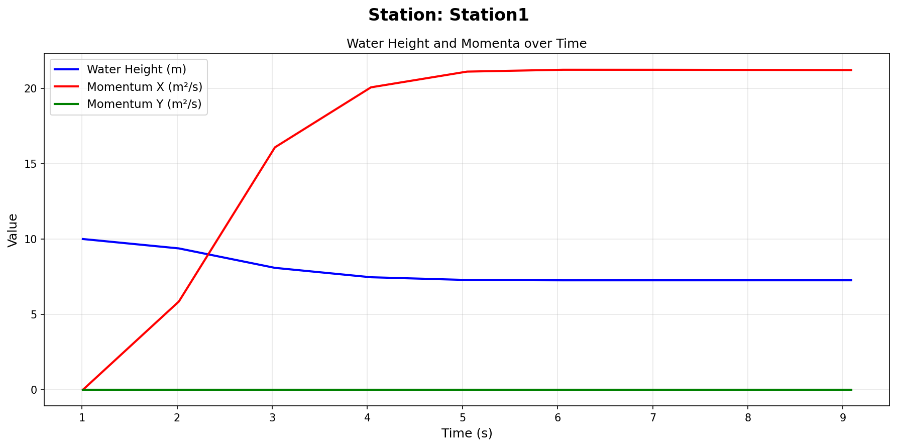
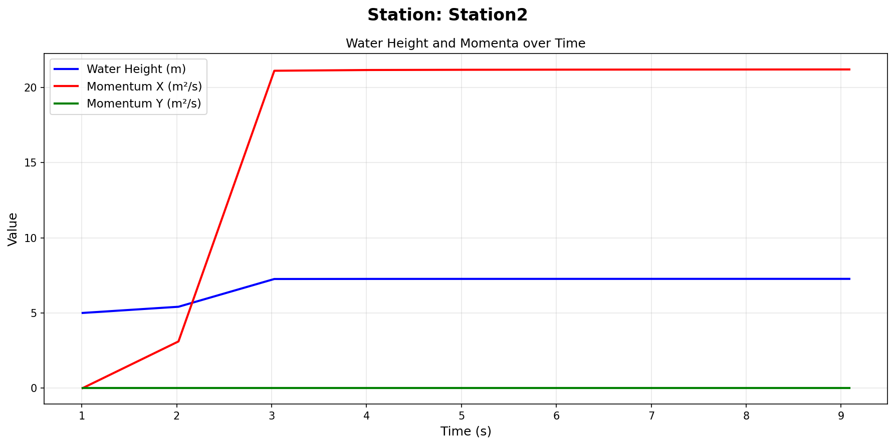
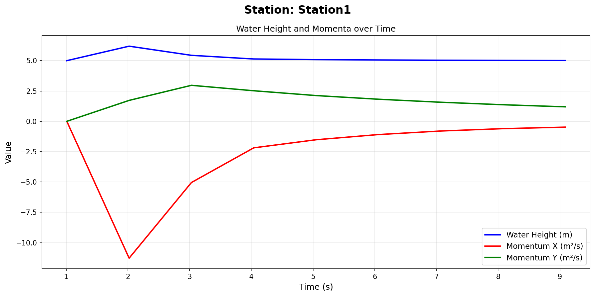
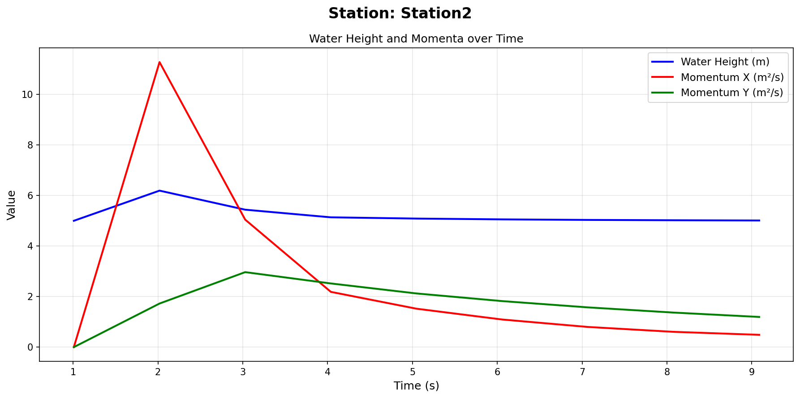

Two-Dimensional Solver
======================

**Authors:** Magdalena Schwarzkopf, Dominik Münch

Overview
--------
So far, we have only been able to simulate one-dimensional settings. This week, we have extended our code to also support two-dimensional simulations.

The ``WavePropagation.h`` header file was always designed to support both one-dimensional and two-dimensional simulations.
The implementation ``WavePropagation1d.cpp`` simply chose to not support two-dimensional simulations by ignoring the y-direction entirely and making functions like ``getMomentumY`` return dummy values.

This week we have also improved our command line interface (in ``main.cpp``) to accept parameters to control the wave propagation mode (1D or 2D), the boundary conditions for 1D simulations and the setup along with their respective parameters.
A summary of the command line interface can be found in the ``README.rst`` file.

Two-Dimensional Wave Propagation
--------------------------------

The new implementation ``WavePropagation2d.cpp`` now fully supports two-dimensional simulations. To do this, we are using the unsplit method:

.. math::

   \begin{aligned}
   Q_{i,j}^{n+1} = Q_{i,j}^n 
   &- \frac{\Delta t}{\Delta x} \left( A^+ \Delta Q_{i-1/2,j} + A^- \Delta Q_{i+1/2,j} \right) \\
   &- \frac{\Delta t}{\Delta y} \left( B^+ \Delta Q_{i,j-1/2} + B^- \Delta Q_{i,j+1/2} \right) \\
   &\quad \forall i \in \{ 1, \dots, n \}, \; j \in \{ 0, \dots, n \}.
   \end{aligned}

This means that a cell now has 4 different updates which each of its neighbours, two in the x-direction and two in the y-direction.
We can calculate the net updates by applying our F-Wave solver (or Roe solver) to the edges between the cell and its neighbours and then applying the net updates to the cell itself.

We can see this in action in the following simulation of a dam break in a 2D domain:

.. video:: ../../../res/two_dimensional_solver/Dam_Break_2d.mp4
   :align: center
   :width: 100%

This looks very similar to the 1D Dam Break simulation but it doesn't really add any new information since it's basically just a copy of the 1D simulation for each y-value.

To illustrate the 2D simulation when the y-direction actually has an effect, we implemented the ``CircularDamBreak2d.cpp`` setup which simulates a circular dam break in the middle of a :math:`100 \times 100` domain.

.. video:: ../../../res/two_dimensional_solver/Circular_Dam_Break_2d_no_bath.mp4
   :align: center
   :width: 100%

We can now see the wave propagating in a circular manner in all directions. 

The above simulation also didn't have any bathymetry. To show the effects that bathymetry can have in two dimensions, we added bathymetry as follows:

.. math::

    b(x, y) = \begin{cases}
        \frac{x^2}{400} + \frac{y^2}{400} & \text{if } \sqrt{(x + 20)^2 + y^2} < 7 \\
        0 & \text{otherwise}
    \end{cases}

That means that there is now a small hill in the water. To show the effects this has on the simulation, we can take a look at the following simulation:

.. video:: ../../../res/two_dimensional_solver/Circular_Dam_Break_2d_bath.mp4
   :align: center
   :width: 100%

As we can see there is now a small water valley right above the bathymetry. We can compare this to our simulation of the :ref:`subcritical setup <subcritical_setup>` where we can also see this exact phenomenon.
A small water valley forming right above the hill in the bathymetry.

Of course, this new implementation also has a unit test which tests basic features of the 2D wave propagation.

Stations
--------
We want to be able to compare our simulations to the real world. To do this we need to be able to measure data at specific points in our simulation.
We can then compare this data to real world measurements at the same points.

To support this behaviour we have implemented the ``Stations.cpp`` class. It summarizes a collection of stations which are defined by a name, an x-coordinate and a y-coordinate.
These stations are defined by a runtime configuration which can be found at ``stations/Stations.csv``. This file is read at the start of the simulation and the stations are initialized accordingly.
Stations "measure" data by writing the values of the water height and the momenta in the x- and y-direction at the station's coordinates to a file which is located at ``stations/output/{{station_name}}.csv``.
It also supports an output frequency in seconds which controls how often the stations write data to their respective file.

The station data is written in the following format:

.. code-block:: csv

    time, water_height, momentum_x, momentum_y
    0.0, 1.0, 0.0, 0.0
    0.1, 1.2, 0.1, 0.0
    ...

We can now use this new functionality to compare some of our simulations (more specifically a 1D simulation to a 2D simulation) at specific points. We want to do this by defining two stations like this:

.. code-block:: csv

    Name, X, Y
    Station1,30.0,0.0
    Station2,70.0,0.0

Notice how both of them have their y-coordinate set to 0.0 meaning that they will be relevant in both the 1D and 2D cases.

We now run a 1D Dam Break simulation with a domain size of :math:`100` and initial values of :math:`h_L = 10`, :math:`h_R = 5` and :math:`x_{Dam} = 50`.
This of course means that Station1 will be located in the left half where the water is higher initially and then get lower over time whereas Station2 will
be located in the right half where the water is lower initially and then get higher over time which is reflected in the following plots:

To compare this to the 2D case, we run the simulation again with a 2D Circular Dam Break setup with the same initial values as before and a circular dam in the middle of the x-domain with coordinates :math:`(x_{Mid}, y_{Mid}) = (50, 0)` and a radius of :math:`5`.
This means that the stations will now be located at a symmetric position away from the circular dam and both with an initial height of :math:`5`. Since they are symmetrically located, they will have the same values 
for the water height and momenta with the momenta in the x-direction having a different sign. This is reflected in the following plots:

The ``Stations.test.cpp`` file implements a unit test for the Stations class and its essential functionalities.

Individual Contributions
------------------------
Note: The reason that all the commits in our GitHub repository come from Dominik Münch's account is that we have set up an SSH key for the tl11 user to that account so all the commits come from there but that doesn't imply that all the work was done by Dominik.

* Dominik Münch: implementation of the 2D wave propagation in ``WavePropagation2d.cpp``, implementation of the new command line interface in ``main.cpp`` and also implemented the unit test for the 2D wave propagation, also wrote the sphinx documentation
* Magdalena Schwarzkopf: implementation of the Circular Dam Break setup in ``CircularDamBreak2d.cpp``, implementation of the Stations class in ``Stations.cpp`` and ``Stations.h`` along with the respective unit test in ``Stations.test.cpp``