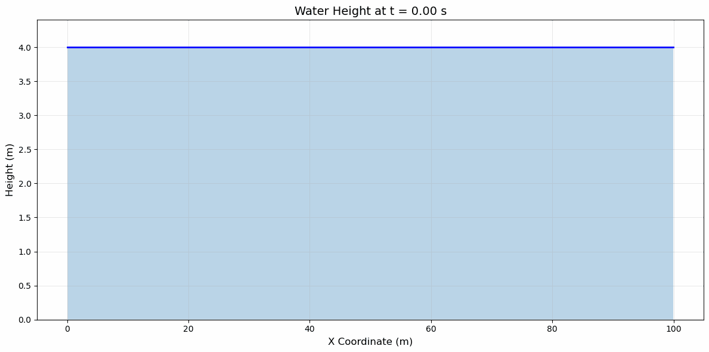
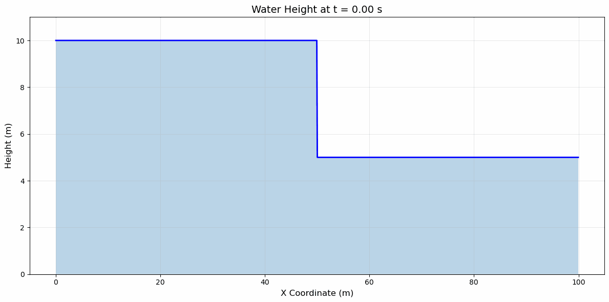
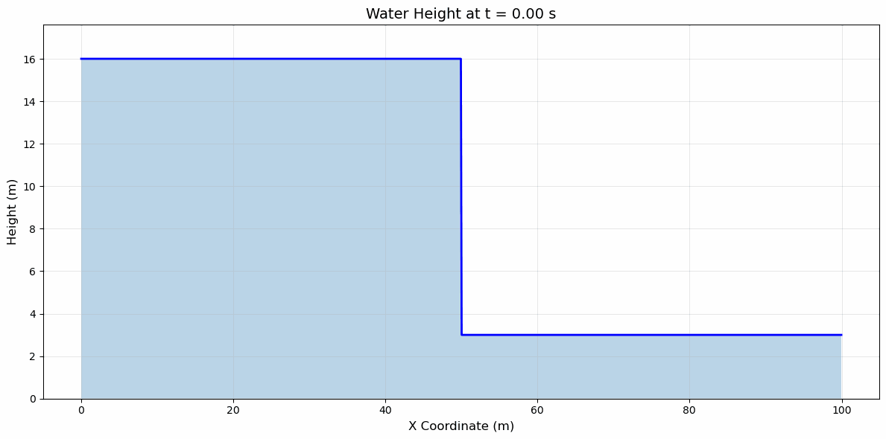
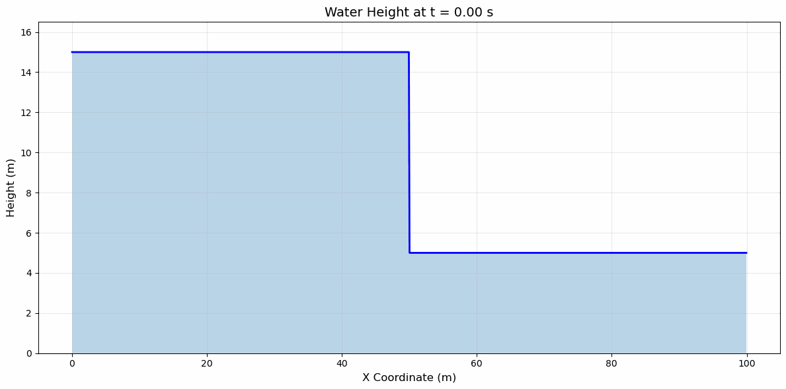
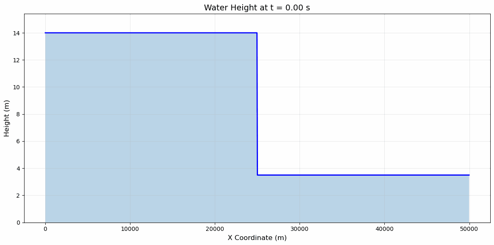

Finite Volume Discretization
============================

**Authors:** Magdalena Schwarzkopf, Dominik Münch

Overview
--------
To simulate the Wave Propagation we can discretize the finite domain into cells each with a constant height and momentum.

``WavePropagation.cpp`` solves the Riemann problems for each edge in the one-dimensional domain and then applies the net updates to the neighbouring cells.
It was also changed to include a ``m_useFWaveSolver`` variable that determines whether to use the FWave Solver or the Roe Solver to solve the Riemann problem.

``DamBreak1d.cpp`` implements the dam break setup and is expanded to also include the possibility to include momenta for the right or left side.
That way both the classical case with no momentum and a case like the village evacuation case (where the river has an initial momentum) is covered.

``RareRare1d.cpp`` implements the Rare Rare setup where the height and momenta are identical except for the momenta having opposite signs.
In the Rare Rare setup the two streams of water are moving away from each other which means that the left side has the negative momentum and the right side has the positive momentum.

``ShockShock1d.cpp`` implements the Shock Shock setup which is identical to the Rare Rare setup except for the fact that the streams of water are now moving towards each other.
This means that the left side has the positive momentum and the right side has the negative momentum.

``visualize_solutions.py`` implements a way to visualize the results of a simulation using the generated csv files by creating a height plot for the whole x-domain and then putting them all together in a gif.

``Csv.cpp`` was changed to also have a time column which is then used in the python script.

``main.cpp`` has been changed to include more arguments when running it. You now have to specify the amount of cells in the x-direction, the size of the domain, the solver mode (1 for FWave, 0 for Roe) and the end time of the simulation.

Unit tests
----------
``WavePropagation1d.test.cpp`` implements test cases for the ``WavePropagation1d.cpp`` class. There is a test case for the Roe solver and one for the FWave solver.
The FWave solver test case uses the ``middle_states.csv`` file (the first 1000 lines of it) to verify correct calculation by running 100 time steps and then checking whether the height of one of the middle cells matches the height specified in the csv file within a window of :math:`10^{-3}`.

``DamBreak1d.test.cpp`` implements a unit test for the Dam Break setup verifying whether height and momenta were assigned correctly on both sides.

``RareRare1d.test.cpp`` implements a unit test for the Rare Rare setup verifying whether height and momenta were assigned correctly on both sides.

``ShockShock1d.test.cpp`` implements a unit test for the Shock Shock setup verifying whether height and momenta were assigned correctly on both sides.

Continuous Integration
----------------------
Every commit to the ``main`` branch triggers the ``main.yml`` pipeline which runs a static code analysis using cppcheck, unit tests, sanitizer builds and Valgrind memory checks along with release builds.
Since this also triggers all unit tests it is sufficient for task 1.3.

Shock Shock Setup and Rare Rare Setup observations
--------------------------------------------------

When playing around with different values for height and momentum there are a few important observations.

1. Changing the momentum doesn't change the speed of the wave. This makes sense since the momenta on both sides cancel each other out during the wave speeds calculation.
2. Changing the momentum does change how far the wave goes up/down.

We can see this in action in the following simulations:

- Shock Shock with parameters :math:`(h = 4, m = 2)`:

- Shock Shock with parameters :math:`(h = 4, m = 10)`:

As you can see, this only changes how high the wave is in the middle but not how fast it travels outward.

Since the Rare Rare setup is a symmetrical copy of this scenario the same observation applies:

- Rare Rare with parameters :math:`(h = 4, m = 2)`:

- Rare Rare with parameters :math:`(h = 4, m = 10)`:

3. Changing the height does change the speed of the wave. This also makes sense because the gravitational term is directly influenced by the height.

We can see this in the following simulations:

- Shock Shock with parameters :math:`(h = 10, m = 10)`:

- Rare Rare with parameters :math:`(h = 10, m = 10)`:

As you can see the wave now travels much further outward than before.

Dam-Break observations
----------------------

Impact of the height difference
~~~~~~~~~~~~~~~~~~~~~~~~~~~~~~~
The larger the difference between :math:`h_L` and :math:`h_R`, the faster the shock wave travels and the higher the surge.
You can observe this in the following simulations:

- DamBreak with parameters :math:`(h_L = 10, m_L = 0, h_R = 5, m_R = 0)`:

- DamBreak with parameters :math:`(h_L = 16, m_L = 0, h_R = 3, m_R = 0)`:

The second wave gets much further than the first one.

Impact of :math:`u_r`
~~~~~~~~~~~~~~~~~~~~~
- If :math:`u_r` is negative, it slows the wave down and the wave becomes taller.
- If :math:`u_r` is positive, the wave travels faster and becomes less tall.

This behavior can be observed when calling ``DamBreak1d`` with the following parameters:

- DamBreak with parameters :math:`(h_L = 15, m_L = 0, h_R = 5, m_R = 0)`, this is a no momentum case as a baseline:

- DamBreak with parameters :math:`(h_L = 15, m_L = 0, h_R = 5, m_R = -10)`, :math:`u_r` is negative (wave is slower and taller):

- DamBreak with parameters :math:`(h_L = 15, m_L = 0, h_R = 5, m_R = 10)`, :math:`u_r` is positive (wave is faster and less tall):

However, :math:`u_r`'s impact is relatively small compared to the height values. We can observe this using the following simulation:

- DamBreak with parameters :math:`(h_L = 15, m_L = 0, h_R = 5, m_R = -3)`, much lower value for :math:`u_r`:

Even though the momentum is much lower compared to the simulations above, we can see that the slowdown is similar to the one with the higher momentum.

The evacuation problem
~~~~~~~~~~~~~~~~~~~~~~
We can simulate this scenario by running the following configuration:

- Domain size changed to :math:`50000`
- ``l_nx`` set to :math:`1000`
- End time set to :math:`2300`

- DamBreak with parameters :math:`(h_L = 14, m_L = 0, h_R = 3.5, m_R = 0.7)`:

- The height of the river flowing through the village remains at its normal level (:math:`3.5 \, \text{m}`) at :math:`t = 2186.61 \, \text{s}` (time step 41).
- It increases to :math:`3.8 \, \text{m}` at :math:`t = 2239.94 \, \text{s}` (time step 42).

**Conclusion:** The village must be evacuated within approximately **37 minutes** after the dam breaks.

Individual Contributions
-------------------------
Note: The reason that all the commits in our GitHub repository come from Dominik Münch's account is that we have set up an SSH key for the tl11 user to that account so all the commits come from there but that doesn't imply that all the work was done by Dominik.

* We integrated the f-wave solver into the WavePropagation1d class together along with the test cases
* We also built the python script to create the visualisations together
* Dominik Münch focused on the ShockShock and RareRare setups along with the necessary CLI changes to the main class
* Magdalena Schwarzkopf focused the DamBreak setup and the village evacuation problem